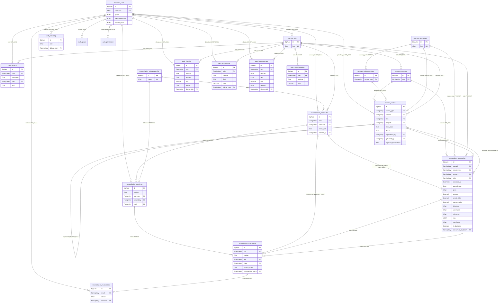

# ERD — Truth of Auditor (untuk migrasi Railway → Contabo)

**Dibangkitkan:** `scripts/erd.py` · **Dasar:** kelas model Django, **OFFLINE — database tidak
disentuh** · **Basis kode:** `origin/main` v1.21.0 + branch migrasi

```bash
/path/ke/.venv/bin/python scripts/erd.py > docs/migrasi/ERD.md   # regenerasi bagian diagram
```

> **Kenapa offline itu penting di sini.** `apps.get_models()` dan `Model._meta` hanya membaca
> kelas Python — tidak ada koneksi yang dibuka, tidak ada query, tidak ada `migrate`. Karena
> itu skrip ini aman dijalankan tanpa `DATABASE_URL`: settings jatuh ke SQLite tetapi tak
> pernah menyambung, jadi **jebakan J1** (diam-diam menulis ke SQLite sambil melaporkan
> sukses) tidak berlaku. Bukti yang dipakai saat pembuatan: `mtime` `db.sqlite3` dev tidak
> berubah sebelum dan sesudah skrip berjalan.

**18 model** di enam app (`core`, `accounts`, `sources`, `transactions`, `reconciliation`,
`web`). Produksi punya **29 tabel** — selisihnya adalah tabel-antara M2M (mis.
`sources_upload_duplicate_transactions`, `accounts_user_allowed_tokos`) plus tabel bawaan
Django (`django_migrations`, `django_session`, `auth_*`, `django_content_type`), yang tidak
punya kelas model sendiri. **Jangan pernah menghitung tabel dari diagram ini** — gerbang
memakai inventaris `information_schema`, bukan daftar hardcoded.

---

## Diagram



---

## Relasi yang load-bearing saat migrasi

Delapan relasi di bawah ini adalah tempat migrasi bisa gagal **tanpa satu pun pesan error**.
Kolom terakhir menyebut gerbang mana yang menangkapnya.

| Relasi | `on_delete` | Kenapa berbahaya | Ditangkap oleh |
|---|---|---|---|
| `Transaction.consumed_by_batch → ReconBatch` | **SET_NULL** | NULL massal membuat 8,8 juta baris "aktif" kembali → seluruhnya direkonsiliasi ulang, hasil ganda. **`SUM(amount)` buta terhadapnya** — nilainya tidak berubah sedikit pun | `gerbang.sql` blok 08b, sensus kolom `consumed_notnull` |
| `MatchResult.resolved_by_batch → ReconBatch` | **SET_NULL** | jejak *late settlement*; hilangnya membalik hasil di batch lama tanpa error, dan angka batch itu sudah pernah dilaporkan ke klien | sensus kolom penentu, mode `final` |
| `MatchResult.run → MatchRun → ReconBatch` | CASCADE | rantai bukti audit. `ReconBatch` unik `(toko, recon_date)` — **batch uji FASE 3 yang tertinggal akan menabrak constraint ini saat restore final** (jebakan J3, alasan pola `toa_new` + tukar nama) | GATE A: hitungan per tabel + constraint |
| `Upload.superseded_by → Upload` (self-FK) | **SET_NULL**, `related_name="supersedes"` | penanda "ketiban". Murni metadata — tak menyentuh engine — tapi hilangnya mengubah dropdown Mutasi Bank dan badge riwayat unggahan | hitungan + sensus kolom |
| `Upload.duplicate_transactions ⟷ Transaction` (**M2M**) | — | tabel-antara `sources_upload_duplicate_transactions` (2,86 juta baris) gampang lolos dari pemeriksaan per-model karena **bukan model**. Tanpanya, filter per-berkas Mutasi Bank menyusut senyap | inventaris tabel + hitungan SEMUA tabel (blok 03/04) |
| `FRKoreksi` · `RekapManual` · `RekapPenyebab` · `HutangManual` (FK `toko` **CASCADE**) | CASCADE | **kelas gagal paling senyap.** Overlay koreksi manusia: Control Bracket dan NET PROFIT berubah tanpa satu pun error di mana pun (jebakan J5). Digerbang dengan `count(*)` **dan** `sum(nilai)` — hitungan saja tidak cukup | blok overlay koreksi (dihitung **dan** dijumlah) |
| `AllowedIP` (`web_allowedip`) | — | **gagal-TERBUKA.** Daftar kosong membuat `IPAllowlistMiddleware` dorman: gerbang IP hilang untuk seluruh auditor & supervisor, dan aplikasi tetap melayani seperti biasa | blok KOSONG-FATAL |
| `AuditLog` (FK user **SET_NULL** + snapshot username) | SET_NULL | integritas jejak audit adalah produk yang dijual aplikasi ini. Tidak boleh berkurang satu baris | hitungan tabel, mode `final` |
| `accounts_user_allowed_tokos` (**M2M**) | — | RBAC per-Toko. Kosong = setiap auditor kehilangan seluruh akses; `sources_toko` kosong = semua pengguna jatuh ke `no_toko` | blok KOSONG-FATAL + RBAC |
| `source_type` · `toko` · `tolerance` (**PROTECT**, 7 relasi) | **PROTECT** | tabel referensi diisi oleh **data migration**, dan `django_migrations` ikut ter-restore dalam keadaan "sudah dijalankan" — jadi `migrate` **tidak akan pernah** mengisinya ulang (jebakan J5). Tabel referensi yang kosong = seluruh ingest dan matching mati, dan tak ada perintah yang memperbaikinya | blok KOSONG-FATAL (`sources_sourcetype`, `sources_toko`, `reconciliation_toleranceprofile`) |

### Tiga hal yang sengaja TIDAK ada di diagram

- **`Transaction.raw` (JSONB)** digambar sebagai satu kolom, padahal isinya kontrak tak-tertulis
  yang dibaca banyak modul: `raw["Kategori"]`, `raw["Sumber"]`, `raw["Bank"]`, `raw["Bank Title"]`,
  `raw["AccountNumber"]`. Gerbang memeriksa `md5(raw::text)` per blok 1 juta id — bukan sekadar
  "kolomnya ada".
- **Index** tidak digambar. 20 index `transactions_transaction` diverifikasi terpisah
  (`indisvalid`) karena `pg_dump` **membuang index yang invalid tanpa peringatan** (jebakan J4).
- **Sequence** tidak digambar. `nextval` vs `max(id)` adalah pemeriksaan sendiri
  (`BAHAYA-TABRAKAN-PK`): sequence yang tertinggal di belakang menyebabkan tabrakan primary key
  pada tulisan pertama pasca-cutover — kegagalan yang datang **setelah** semua gerbang lulus.
