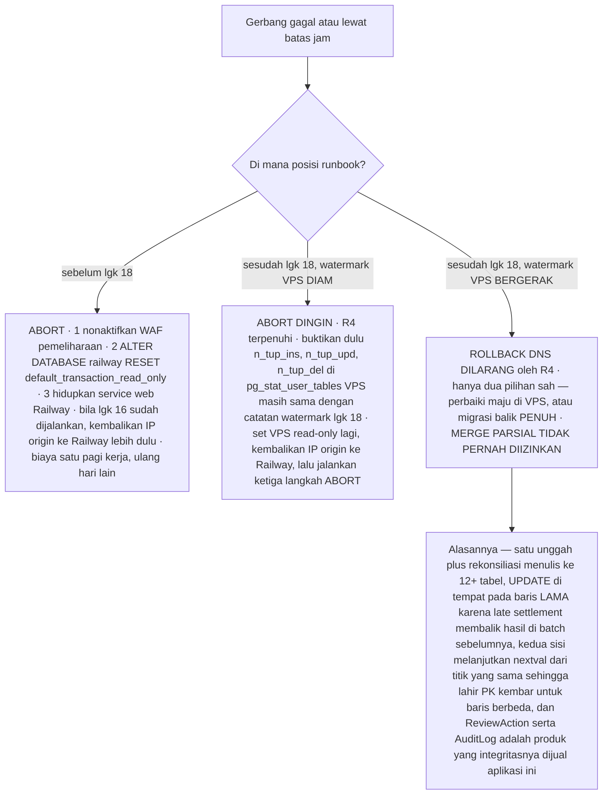

# Peta alur migrasi Railway → Contabo (turunan rencana v2.1)

Berkas ini **bukan sumber kebenaran**. Sumbernya `docs/rencana-migrasi-contabo-2026-08-31.md`
(v2.1) dan `scripts/gerbang.sh`; bila ada beda, **rencana yang menang** — beda yang sudah
diketahui ada di "Catatan penyimpangan". Gunanya satu: membuat bentuk *mesin keadaan* runbook
itu terlihat — di mana rollback masih gratis, di mana ia berhenti gratis, dan gerbang mana
yang menjaga tiap perbatasan.

---

## 1. Diagram utama — FASE 0 s/d FASE 5

```mermaid
stateDiagram-v2
    direction TB

    FASE0: FASE 0 · siapkan mesin — user toa NOPASSWD J8, kunci SSH, drop-in 00-toa-hardening.conf J9, tzdata J11, fail2ban, ufw hanya rentang Cloudflare
    G0: GERBANG 0 dan 1 — ssh toa@IP lalu sudo whoami tanpa password · ssh root@IP harus DITOLAK · sshd -T menegaskan permitrootlogin no dan passwordauthentication no
    FASE1: FASE 1 · tumpukan paritas — PostgreSQL 18 PGDG di port 5432, Python 3.11 deadsnakes, ALTER SYSTEM tiap parameter EKSPLISIT, CREATE DATABASE toa UTF8 en_US.utf8
    FASE2: FASE 2 · restore percobaan — pra-terbang indisvalid produksi J4, fio, profil restore mwm 2GB, dump ber-snapshot MVCC J7, pg_restore ke DB baru, vacuumdb, kembalikan profil paritas
    G2: GERBANG FASE 2 — scripts/gerbang.sh banding IP-VPS live · diff kosong · tanpa KOSONG-FATAL, BAHAYA-TABRAKAN-PK, valid=f, analyzed=BELUM-PERNAH · 29 tabel milik toa · EXPLAIN memakai tx_toko_src_posted_idx
    FASE3: FASE 3 · aplikasi — /opt/toa, /etc/toa.env 640 root:toa J1, toa.service gunicorn 4 worker 8 thread, nginx X-Forwarded-For TIMPA J2, Cloudflare Origin CA J10
    G3: GERBANG FASE 3 — suite 1.700 tes 0 gagal · XFF palsu wajib 403 · wall-clock run_batch toko tersibuk di bawah 80 detik · reboot pulih tanpa langkah manual · zona Full strict · konsol VNC Contabo teruji
    FASE5: FASE 5 · pasca-pindah — toa-deploy, toa-geo-off, toa-backup rclone gcrypt, uji restore cadangan tiap kuartal, tenggat keputusan partisi bulan ke-12
    BERHENTI: BERHENTI · migrasi dibatalkan SEBELUM FASE 4 — produksi tidak pernah tersentuh, tak ada jendela cutover yang perlu dibatalkan

    state FASE4 {
        T1: T-1 hari · lgk 1-5 — diff railway variables lawan /etc/toa.env, mode SSL wajib Full strict, WAF KH ber-scope hostname, siapkan WAF pemeliharaan NONAKTIF, cek IP operator, umumkan jendela dan wajib login ulang
        Tahan: lgk 6-8 · 06:40 pastikan tak ada ReconBatch berjalan · 06:45 aktifkan WAF pemeliharaan lalu verifikasi dari luar dan dari IP operator · 06:50 hentikan service web Railway
        Beku: lgk 9 · 06:55 R1 ALTER DATABASE railway SET default_transaction_read_only=on plus pg_terminate_backend · catat pg_stat_user_tables dan max id SISI SUMBER
        Dump: lgk 10 · 07:00 cek indisvalid produksi J4, lalu pg_dump --format=directory --jobs=4 --snapshot --statistics --compress=zstd:3 DITARIK OLEH VPS di dalam tmux · est 30-90m
        Restore: lgk 11 · 08:15 systemctl stop toa, DROP dan CREATE toa_new, pg_restore --jobs=8 --no-owner --no-privileges --no-comments --exit-on-error · est 60-120m
        Vacuum: lgk 12 · 09:45 vacuumdb --analyze-in-stages --jobs=8 lalu vacuumdb --analyze · langkah SENDIRI, rencana melarang menggabungnya dengan restore · est 10-25m
        GATE_A: lgk 13 · 10:10 DB_VPS=toa_new scripts/gerbang.sh banding IP-VPS final plus periksa_index · checksum wajib sama sampai sen · est 15m
        Tukar: lgk 14 · 10:25 ALTER DATABASE toa RENAME TO toa_fase3 lalu toa_new RENAME TO toa · set read-only · start toa · migrate · periksa_index · est 10m
        GATE_B: lgk 15 · 10:35 smoke test lokal lewat curl --resolve, lalu waktu dashboard dibanding patokan FASE 3 · est 10m
        DNS: lgk 16 · 10:45 pindahkan IP origin di dashboard Cloudflare, TETAP ORANYE, screenshot sebelum dan sesudah, Purge Everything · est 5m
        GATE_C: lgk 17 · 10:50 uji lewat hostname produksi asli sementara publik masih ditahan WAF — login, 3 dashboard, pratinjau ingest, /bracket/, /rekap-bulanan/, uji XFF J2 wajib 403 · est 20m
        Buka: lgk 18 · 11:10 ALTER DATABASE toa RESET default_transaction_read_only plus restart · CATAT WATERMARK — INI BATAS SPLIT-BRAIN · est 5m
        Bukti: lgk 19 · 11:15 satu tulisan nyata end-to-end — unggah berkas kecil, jalankan rekonsiliasi, cocokkan angka · est 15m
        Publik: lgk 20-21 · 11:30 nonaktifkan WAF pemeliharaan, situs publik · 11:35 umumkan selesai plus notis login ulang, manage.py clearsessions
        ABORT: ABORT · nonaktifkan WAF pemeliharaan, ALTER DATABASE railway RESET default_transaction_read_only, hidupkan service web Railway · DNS tak pernah disentuh, VPS tak pernah menerima tulisan · ulang hari lain
        ABORT_DINGIN: ABORT DINGIN · DNS sudah pindah tapi watermark VPS DIAM sehingga R4 terpenuhi · set VPS read-only lagi, kembalikan IP origin ke Railway, lalu jalankan ketiga langkah ABORT
        PERBAIKI_MAJU: PERBAIKI MAJU · watermark VPS BERGERAK sehingga R4 melarang rollback DNS · hanya dua pilihan sah, perbaiki maju di VPS atau migrasi balik PENUH · MERGE PARSIAL TIDAK PERNAH DIIZINKAN

        [*] --> T1
        T1 --> Tahan
        Tahan --> Beku
        Beku --> Dump: R1 terpenuhi — beku di level DB, bukan sekadar service mati
        Dump --> Restore: dump terbukti utuh lewat pg_restore ke /dev/null, bukan cuma --list
        Dump --> ABORT: [jam > 08:45 dan dump belum selesai]
        Restore --> Vacuum
        Vacuum --> GATE_A: R3 watermark VPS ke-1 dicatat
        GATE_A --> Tukar: [diff kosong dan periksa_index bersih]
        GATE_A --> ABORT: [jam > 11:00 atau diff tidak kosong]
        Tukar --> GATE_B
        GATE_B --> DNS: [smoke test lulus dan waktu dashboard setara FASE 3]
        GATE_B --> ABORT: [gagal — DNS belum disentuh, mundur masih gratis]
        DNS --> GATE_C
        GATE_C --> Buka: [semua butir lulus] R3 watermark VPS ke-2 dicatat saat membuka
        GATE_C --> ABORT_DINGIN: [gagal sesudah DNS pindah, watermark VPS masih diam]
        Buka --> Bukti
        Bukti --> Publik: [angka cocok persis]
        Bukti --> PERBAIKI_MAJU: [angka tidak cocok — tulisan sudah mendarat di VPS]
        Publik --> [*]
    }

    [*] --> FASE0
    FASE0 --> G0
    G0 --> FASE1: [kedua gerbang lulus]
    G0 --> BERHENTI: [gagal — sesi root masih terbuka, itu satu-satunya jalan mundur]
    FASE1 --> FASE2
    FASE2 --> G2
    G2 --> FASE3: [gerbang lulus]
    G2 --> BERHENTI: [satu saja meleset]
    FASE3 --> G3
    G3 --> FASE4: [semua butir gerbang FASE 3 lulus]
    G3 --> BERHENTI: [ada butir gagal]
    FASE4 --> FASE5: cutover selesai
    FASE5 --> [*]
```

---

## 2. R1–R5 dibaca sebagai mesin keadaan

**R1 — syarat MASUK state `Dump`.** Railway dibekukan di **level database**
(`ALTER DATABASE railway SET default_transaction_read_only=on` + `pg_terminate_backend`, lgk 9),
bukan cukup dengan `Tahan`/lgk 8 yang hanya mematikan service web. Tiga alasannya: (a) service
web bukan satu-satunya klien — sesi psql, cron, atau operator masih memegang koneksi, itulah
gunanya `pg_terminate_backend`; (b) flag itu properti **database**, jadi ia selamat dari restart
liar — alasan yang sama yang membuat R5 menuntut Railway hidup *read-only*, bukan mati; (c)
tulisan yang mendarat sesudah snapshot **tidak terlihat oleh GATE A**, karena `gerbang.sh`
membatasi kedua sisi pada plafon id sisi-restore. Beku di level DB mematikan kelasnya, bukan
satu kliennya.

**R2 — INVARIAN state sepanjang `Tukar` → `GATE_C`.** Database VPS `default_transaction_read_only
= on` sampai lgk 18. Selama invarian ini berlaku, tiap state di dalamnya masih bisa ditinggalkan
tanpa kehilangan apa pun — "sebelum itu, rollback gratis di titik mana pun". Nuansanya: restore
(lgk 11) jelas harus menulis, jadi flag itu baru dipasang pada lgk 14 setelah rename; jendela
`toa_new` sebelum rename dilindungi cara lain — service `toa` sudah `stop` sejak lgk 11.

**R3 — aksi WAJIB pada transisi `Vacuum → GATE_A` dan pada `Buka`.** Watermark VPS diambil **dua
kali**: pasca-restore dan tepat saat membuka penulisan. Wajib memakai `pg_stat_user_tables`
(`n_tup_upd`/`n_tup_ins`/`n_tup_del`), **bukan hanya `max(id)`** — beban tulis aplikasi ini
sebagian besar UPDATE di tempat (`consumed_by_batch`, flip bucket MatchResult), dan UPDATE tidak
menaikkan `max(id)` sama sekali: watermark `max(id)` melaporkan "VPS masih perawan" padahal
ribuan baris lama sudah berubah, lalu R4 memberi izin rollback yang seharusnya haram. Total ada
**tiga** pencatatan — lgk 9 di **sisi sumber** (Railway); dua yang dimaksud R3 di sisi VPS.

**R4 — guard pada transisi rollback DNS.** Transisi `GATE_C → ABORT_DINGIN` (dan tiap rollback DNS
sesudah lgk 16) hanya **sah** bila watermark VPS belum bergerak — dievaluasi dengan membandingkan
`pg_stat_user_tables` sekarang lawan catatan R3 ke-2. Bila sudah bergerak, transisi itu **tidak
ada**: yang tersisa hanya `PERBAIKI_MAJU`. **Merge parsial tidak pernah diizinkan.**

**R5 — invarian PASCA-FASE 4.** Railway tetap hidup **≥7 hari dalam keadaan read-only**. Bukan
dimatikan (agar masih bisa dibaca/dibandingkan bila ada temuan), bukan pula dibuka (agar restart
liar tak bisa menerima tulisan dan menciptakan split-brain berhari-hari sesudah cutover).

---

## 3. Titik-tanpa-kembali

| Langkah | Reversibel? | Biaya mundur | Yang hilang bila dipaksa mundur |
|---|---|---|---|
| 7 · WAF pemeliharaan aktif | Ya, penuh | ~2 menit (lgk 20 kebalikannya) | Tidak ada — hanya waktu henti operator |
| 8 · service web Railway dihentikan | Ya, penuh | Hidupkan kembali service | Tidak ada |
| 9 · R1 beku level DB | Ya, penuh | `ALTER DATABASE railway RESET default_transaction_read_only` | Tidak ada — justru ini yang membuat semua langkah berikut gratis |
| 10 · dump ber-snapshot | Ya | 30–90 menit hangus, ulang dari awal di hari lain | Hanya dump itu sendiri; produksi utuh |
| 11 · restore ke `toa_new` | Ya | `DROP DATABASE toa_new`, 60–120 menit | Hanya hasil restore. `toa` FASE 3 belum tersentuh — inilah gunanya J3 me-restore ke DB BARU |
| 12 · vacuumdb | Ya | 10–25 menit | Hanya statistik planner |
| 13 · GATE A | Ya | Titik keputusan **murah terakhir**; batas keras 11:00 | Tidak ada |
| 14 · tukar nama + migrate | Ya | Rollback ±2 detik: rename balik `toa`→`toa_new`, `toa_fase3`→`toa` | Tidak ada — DB baru read-only sejak detik pertama (R2) |
| 15 · GATE B | Ya | Sama seperti 14 | Tidak ada |
| 16 · IP origin dipindah di Cloudflare | Ya | Kembalikan IP origin + Purge Everything, tunggu propagasi edge | Tidak ada tulisan. Record tetap **oranye**, jadi IP VPS tidak ikut terpublikasi |
| 17 · GATE C | Ya, lewat ABORT DINGIN | Rollback DNS + set read-only lagi | Tidak ada |
| **18 · RESET read-only** | **BATAS SPLIT-BRAIN** | Selama watermark **diam**: masih reversibel (ABORT DINGIN). Begitu **bergerak**: **TIDAK reversibel** | Setiap tulisan yang lahir di VPS — MatchResult, ReviewAction, AuditLog, UPDATE di tempat pada baris lama. `nextval` kedua sisi berjalan dari titik yang sama, jadi PK kembar membuat merge mustahil |
| 19 · tulisan nyata end-to-end | Tidak — secara desain inilah yang menggerakkan watermark | Hanya perbaiki maju atau migrasi balik penuh | Sama seperti 18 |
| 20–21 · WAF dimatikan, publik masuk | WAF bisa dipasang lagi, tapi itu tidak mengembalikan apa pun | Nyalakan lagi WAF pemeliharaan | Tulisan pengguna nyata sudah bercampur; tiap menit menambah baris yang tak bisa di-merge |

> **Merge parsial TIDAK PERNAH diizinkan** — di titik mana pun, atas alasan apa pun.

---

## 4. Pohon keputusan abort

---

## 5. Jadwal berwaktu FASE 4 (WIB)

| Jam | # | Langkah | Gerbang | Batas abort |
|---|---|---|---|---|
| 06:40 | 6 | Konfirmasi tak ada `ReconBatch` berjalan | — | — |
| 06:45 | 7 | Aktifkan WAF pemeliharaan | Verifikasi dari luar (halaman Indonesia) **dan** dari IP operator (lolos) | — |
| 06:50 | 8 | Hentikan service web Railway | — | — |
| 06:55 | 9 | **R1** beku level DB + `pg_terminate_backend`; catat watermark sumber | R1 | — |
| 07:00 | 10 | Cek `indisvalid` (J4); dump ber-snapshot ditarik VPS · **30–90m** | — | **08:45 — dump belum selesai → ABORT** |
| ~08:15 | 11 | `stop toa`; DROP/CREATE `toa_new`; restore `-j 8 --exit-on-error` · **60–120m** | — | — |
| ~09:45 | 12 | `vacuumdb --analyze-in-stages -j 8` · **10–25m** | — | — |
| ~10:10 | 13 | `gerbang.sh banding <ip> final` + `periksa_index` · 15m | **GATE A** — checksum sama sampai sen | **11:00 — GATE A belum lulus → ABORT** |
| ~10:25 | 14 | Rename `toa`→`toa_fase3`, `toa_new`→`toa`; set read-only; start; `migrate`; `periksa_index` · 10m | — | — |
| ~10:35 | 15 | Smoke test lokal `curl --resolve`, waktu dashboard vs FASE 3 · 10m | **GATE B** | — |
| ~10:45 | 16 | Pindah IP origin di dashboard Cloudflare, tetap oranye, Purge Everything · 5m | — | — |
| ~10:50 | 17 | Uji lewat hostname produksi asli + uji XFF J2 → 403 · 20m | **GATE C** | — |
| ~11:10 | 18 | **Buka penulisan** + catat watermark · 5m | — | **Batas split-brain (R4)** |
| ~11:15 | 19 | Satu tulisan nyata end-to-end · 15m | — | — |
| ~11:30 | 20 | Nonaktifkan WAF pemeliharaan; situs publik · 2m | — | — |
| ~11:35 | 21 | Umumkan selesai + notis login ulang; `manage.py clearsessions` · 10m | — | — |

**Total realistis 06:45 → 11:35 ≈ 4 jam 50 menit**, selesai ±90 menit sebelum jendela unggah 13:00.

---

## Catatan penyimpangan

1. **`T1` dan `Tahan` ditambahkan** agar penomoran 1–21 utuh: daftar state yang diminta mulai dari
   `Beku`, sehingga lgk 1–5 (T-1 hari) dan lgk 6–8 tidak punya rumah.
2. **`Restore` dipecah jadi `Restore` + `Vacuum`.** Rencana lgk 12 menulis eksplisit "langkah
   sendiri, jangan digabung". Instruksi meminta satu state `Restore`; **rencana yang diikuti**.
3. **`ABORT_DINGIN` bukan nama dari rencana.** Rencana mendefinisikan **satu** prosedur abort
   ("murah dan identik", tiga langkah); cabang pasca-DNS disusun dari R4, bukan dikutip runbook.
4. **Guard GATE_A lebih ketat dari rencana.** Rencana hanya menyebut "11:00 GATE A belum lulus →
   abort" — harfiahnya diff gagal masih boleh diulang selama belum 11:00. Guard `[jam > 11:00 atau
   diff tidak kosong]` dipakai apa adanya; bila waktu tersisa dan penyebabnya terjelaskan serta
   terperbaiki, rencana **mengizinkan** satu ulangan.
5. **Transisi gagal dari GATE_B dan GATE_C adalah inferensi** dari R1–R5 + "sebelum itu, rollback
   gratis di titik mana pun"; rencana hanya menamai dua batas abort keras (08:45, 11:00).
6. **Rencana tidak memberi mekanik apa pun untuk "migrasi balik penuh"** — sengaja tidak dikarang
   di sini. Tulis prosedurnya sebelum hari-H, atau terima `PERBAIKI_MAJU` sebagai cabang tak teruji.
7. **`BERHENTI` bukan ABORT** — gagal gerbang sebelum FASE 4 membatalkan migrasi tanpa menyentuh produksi.
8. **Angka `est` dan jam** diambil apa adanya dari tabel Hari-H rencana v2.1.
